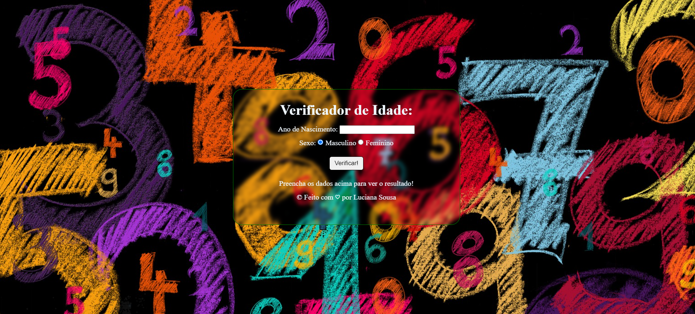

# Verificador de Idade

Este é um projeto simples de verificador de idade que utiliza HTML, CSS e JavaScript para determinar a faixa etária de uma pessoa e exibir uma imagem correspondente. O objetivo deste projeto é fornecer uma interface intuitiva para verificar a idade e mostrar uma imagem representativa da faixa etária.

## Funcionalidades

- **Verificação de Idade**: Insira seu ano de nascimento e clique no botão "Verificar" para determinar a sua faixa etária.
- **Exibição de Imagem**: Após a verificação da idade, uma imagem representativa da faixa etária será exibida na tela.

## Tecnologias Utilizadas

- **HTML**: Utilizado para estruturar a página web.
- **CSS**: Estilização da página para melhorar a experiência do usuário.
- **JavaScript**: Implementação da lógica para verificar a idade e exibir a imagem correspondente.

## Como Utilizar

1. Clone ou faça o download deste repositório.
2. Abra o arquivo `index.html` no seu navegador web.
3. Insira a sua data de nascimento no campo de entrada.
4. Clique no botão "Verificar".
5. Observe a imagem correspondente à sua faixa etária exibida na tela.

## Contribuição

Contribuições são bem-vindas! Sinta-se à vontade para fazer um fork deste repositório e propor melhorias através de pull requests.

